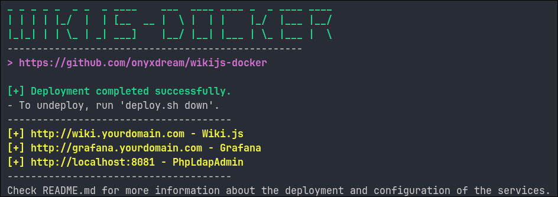

# wikijs-docker

Containerized documentation platform using Wiki.js, PostgreSQL, and NGINX. Includes HTTPS, LDAP authentication, monitoring with Prometheus and Grafana, and automated backups. Designed for secure, scalable deployment and reproducibility using Docker Compose.

